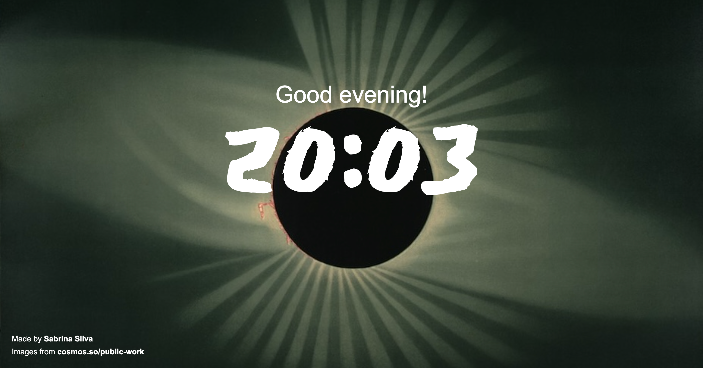

# Context
I made this page as one of my first projects from CursoemVideo's course about Java Script.
My main goal was to exercise Java Script sintax and logic, so I created this page that show messages and images based on your current time.

### Morning version (05h - 11h)

### Afternoon version (12h - 18h)

### Night version (19h - 04h)
